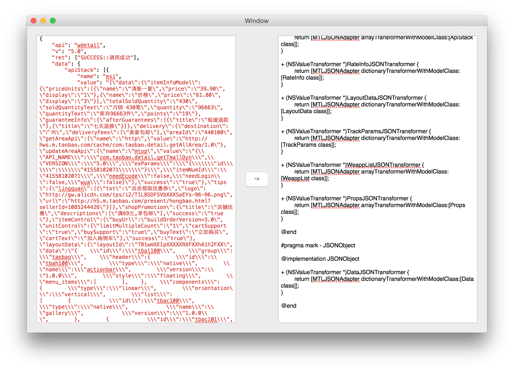

###JSONConvertor
Convert JSON String to Objective-C Model Class for [Mantle](https://github.com/Mantle/Mantle).


###Sample
JSON String:
```
{
  "array": [
    {
      "key1": "value11",
      "key2": "value12"
    },
    {
      "key1": "value21",
      "key2": "value22"
    }
  ],
  "boolean": true,
  "null": null,
  "number": 123,
  "object": {
    "a": "b",
    "c": "d",
    "e": "f"
  },
  "string": "Hello World"
}
```

Model Class for [Mantle](https://github.com/Mantle/Mantle):
```
// ------------ Interface ------------

#pragma mark - Array

@interface Array : KSBaseModel

@property (nonatomic, copy) NSString *key1;
@property (nonatomic, copy) NSString *key2;

@end

#pragma mark - Object

@interface Object : KSBaseModel

@property (nonatomic, copy) NSString *a;
@property (nonatomic, copy) NSString *c;
@property (nonatomic, copy) NSString *e;

@end

#pragma mark - RootClass

@interface RootClass : KSBaseModel

@property (nonatomic, strong) NSArray *array;
@property (nonatomic, strong) NSNumber *number;
@property (nonatomic, strong) Object *object;
@property (nonatomic, copy) NSString *string;
@property (nonatomic, assign) BOOL boolean;
@property (nonatomic, strong) NSNull *null;

@end

// ------------ Implementation ------------

#pragma mark - Array

@implementation Array

@end

#pragma mark - Object

@implementation Object

@end

#pragma mark - RootClass

@implementation RootClass

+ (NSValueTransformer *)ArrayJSONTransformer {
	return [MTLJSONAdapter arrayTransformerWithModelClass:[Array class]];
}

+ (NSValueTransformer *)ObjectJSONTransformer {
	return [MTLJSONAdapter dictionaryTransformerWithModelClass:[Object class]];
}

@end

```

###Not Support Now
* 2D array
* different element in array
* NSURL
